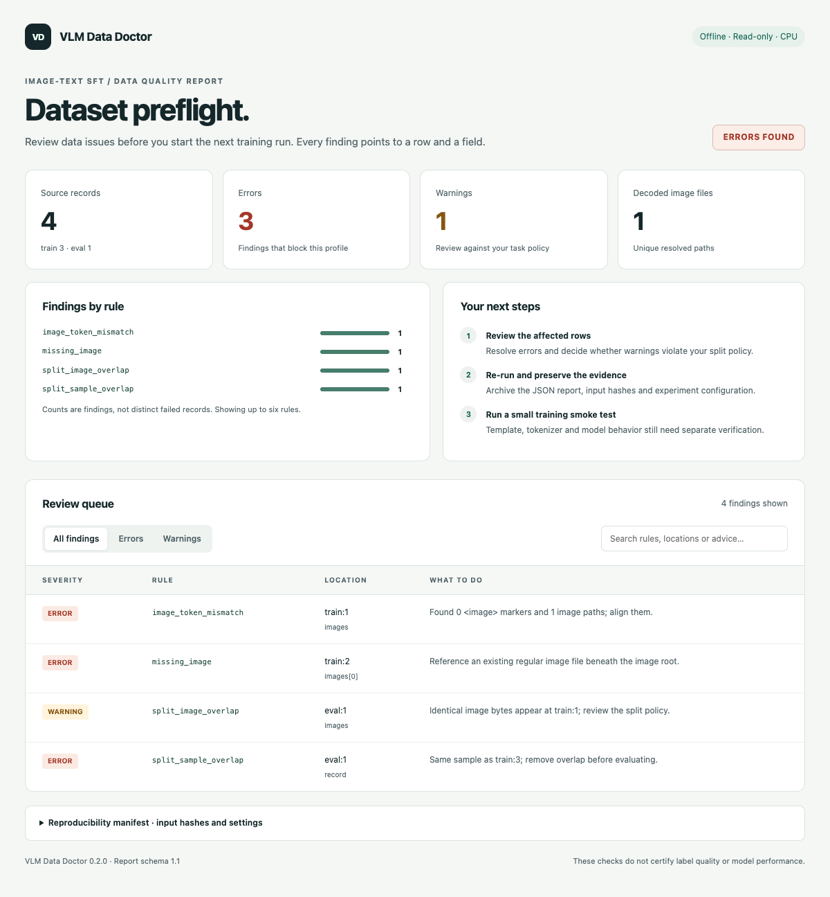

# VLM Data Doctor

Check image-text SFT data for broken records and train/eval overlap before training.

[](https://github.com/chrischen-coder/vlm-data-doctor/actions/workflows/ci.yml)
[](pyproject.toml)
[](LICENSE)
[](https://github.com/chrischen-coder/vlm-data-doctor/releases/tag/v0.2.0)

[简体中文](README.zh-CN.md) · [Quick start](#quick-start) · [Use cases](docs/impact.md) · [Checks](docs/checks.md) · [LlamaFactory](docs/integrations/llamafactory.md)

Valid JSON can still reference missing images, contain mismatched `<image>` markers,
or put pages from the same document in both training and evaluation.

Run this checker after exporting your data and before submitting a training job.
It reports the affected rows and fields, with advice for each finding.

## When to use it

| Problem | Check | Next action |
| --- | --- | --- |
| An SFT export needs checking for broken images and malformed records | Conversations, image markers and local image decoding | Repair the reported rows, then retry |
| A document QA experiment splits rows but may share source documents across splits | Exact sample/image overlap; source overlap with `--group-key document_id` | Split by the unit your experiment requires, then recheck |
| A rerun uses edited data with the same filenames and record counts | Dataset hashes, valid-image inventory hash, checker version and settings | Archive the report with the experiment and compare input fingerprints |

The checks cover structure and exact overlap. They do not judge answer correctness
or detect recompressed, cropped or semantically similar images.



Search findings and filter by severity. [Download the offline example](https://github.com/chrischen-coder/vlm-data-doctor/releases/download/v0.2.0/report.html) · [Mobile view](docs/assets/report-mobile.png)

## Quick start

Python 3.10+. Install from the repository:

```bash
git clone https://github.com/chrischen-coder/vlm-data-doctor.git
cd vlm-data-doctor
python -m venv .venv
```

Activate with `source .venv/bin/activate` on macOS/Linux or `.venv\Scripts\Activate.ps1` in Windows PowerShell.

```bash
python -m pip install .
vlm-data-doctor check examples/clean/train.jsonl --eval examples/clean/validation.jsonl --strict
```

Expected: two training records, one evaluation record, no errors or warnings.
Pillow is the only runtime dependency. Runs on CPU, loads no model, calls no external
API and leaves input files unchanged.

Generate a report from faulty data:

```bash
vlm-data-doctor check examples/broken/train.jsonl --eval examples/broken/validation.jsonl --image-root examples/clean --format html --output report.html
```

Open `report.html` in your browser. The fixture has three errors and one warning,
so the command exits `1` but still writes the report. Use a new output filename
on subsequent runs; existing files are not overwritten.

## Example: different images, shared document

The [document split example](examples/document-split/README.md) uses two generated manuals.
Training contains page 1 of manual A; evaluation contains page 2 of A. The images,
questions and answers differ, so exact deduplication passes. An experiment measuring
generalization to **unseen documents** still needs to keep these pages together.

```bash
vlm-data-doctor check examples/document-split/train.jsonl --eval examples/document-split/validation.jsonl --group-key document_id
```

```text
ERROR split_group_overlap eval:1 document_id: The selected group also appears at train:1; use a group-disjoint split.
```

The example includes checks without grouping, with grouping, and with a separate
manual for evaluation. Group IDs come from your data; the checker does not infer them.

## Bring your data

Use a JSON array or JSONL, with `messages` or ShareGPT `conversations`:

```json
{
  "document_id": "manual-a",
  "messages": [
    {"role": "user", "content": "<image>What color is this square?"},
    {"role": "assistant", "content": "Red."}
  ],
  "images": ["images/red.png"]
}
```

Image paths resolve relative to each dataset file. Set `--image-root` for a common
root or `--eval-image-root` for a separate evaluation root. `document_id` is required
only when selected with `--group-key`; use a nonempty string or integer.

```bash
vlm-data-doctor check data/train.jsonl --eval data/test.jsonl --image-root data --group-key document_id --format json --output audit.json
```

Exit codes: `0` = no errors; `1` = data errors; `2` = configuration or I/O failure.
`--strict` also fails on warnings. The output directory must exist. Image reuse
across splits needs review; it is not always a reason to delete a sample.

[LlamaFactory mapping and training gate](docs/integrations/llamafactory.md) · [Python API, rules and limits](docs/checks.md)

## Method and evidence

Fixed rules validate the format. Pillow decodes images. SHA-256 fingerprints match
normalized conversations and image file bytes. Group checks compare the supplied
source IDs. There is no learned detector or semantic quality score.

| Validation | Result and scope |
| --- | --- |
| Synthetic regression | 128/128 annotated target findings; 32 clean controls without findings. Cases were built from known rules |
| CPU audit | 50,000 rows: 1.87 s median, 49.5 MiB peak RSS on Apple M5, reusing 256 small images |
| Pinned LlamaFactory fixture | Six records, three images passed static checks; no trainer execution |

These results do not measure field accuracy or downstream model improvement.
[Methods, raw results and reproduction commands](docs/benchmarks.md).

## Next

Measure misses and false alarms on independently labeled data, then investigate
recompressed-image duplicates. Semantic quality checks and downstream benefits
need separate annotations and controlled training runs. [Problems and acceptance criteria](docs/roadmap.md).

Use [LlamaFactory](https://github.com/hiyouga/LlamaFactory) for training,
[Data-Juicer](https://github.com/datajuicer/data-juicer) for broader data processing,
and [Cleanlab](https://github.com/cleanlab/cleanlab) for data and label quality workflows.

[Contributing](CONTRIBUTING.md) · [Changelog](CHANGELOG.md) · [Software citation](CITATION.cff)

Code and generated fixtures are MIT licensed.
