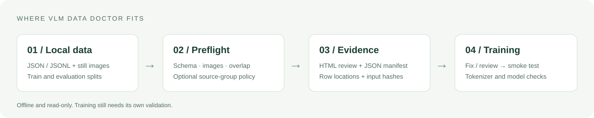

# VLM Data Doctor

**训练之前发现图文数据问题，检查集合重叠，保存可复现证据。**

[](https://github.com/chrischen-coder/vlm-data-doctor/actions/workflows/ci.yml)
[](pyproject.toml)
[](LICENSE)
[](https://github.com/chrischen-coder/vlm-data-doctor/releases/tag/v0.2.0)

[English](README.md) · [快速开始](#快速开始) · [实测结果](#实测结果) · [论文与业界价值](docs/impact.zh-CN.md) · [LlamaFactory 接入](docs/integrations/llamafactory.md)

面向准备图文 SFT 数据的研究者和算法工程师：检查 ShareGPT/messages 对话、本地图片、
重复样本与训练／评测集重叠，输出可筛选的 HTML 报告和包含输入哈希的 JSON 记录。

**CPU 即可运行，不加载模型、不需要 API Key，检查过程离线，不修改原始数据。**


*实际运行截图，支持按严重程度筛选、搜索规则与位置、查看复现信息。
[下载离线演示报告](https://github.com/chrischen-coder/vlm-data-doctor/releases/download/v0.2.0/report.html)
或用下面的命令生成。[手机端效果](docs/assets/report-mobile.png)。*

## 快速开始

需要 Python 3.10+。请从仓库安装，目前未发布到 PyPI。

```bash
git clone https://github.com/chrischen-coder/vlm-data-doctor.git
cd vlm-data-doctor
python -m venv .venv
```

macOS/Linux 执行 `source .venv/bin/activate`，Windows PowerShell 执行
`.venv\Scripts\Activate.ps1`，然后：

```bash
python -m pip install .
vlm-data-doctor check examples/clean/train.jsonl --eval examples/clean/validation.jsonl --strict
```

预期输出：2 条训练样本、1 条评测样本、3 个图片文件，0 错误、0 警告。

生成故障样例的效果报告：

```bash
vlm-data-doctor check examples/broken/train.jsonl --eval examples/broken/validation.jsonl --image-root examples/clean --format html --output report.html
```

用浏览器打开 `report.html`。这个命令**故意返回退出码 1**：样例中有 3 个错误和 1 个警告，
报告仍会写出。每次请使用新的输出文件名，工具不会覆盖已有文件。

## 可以帮助你完成什么

| 能力 | 具体产出 |
| --- | --- |
| JSON、角色、对话顺序和图片占位符校验 | 定位到行与字段的修复建议 |
| 图片存在性、完整解码、大小限制 | 提前发现缺图、坏图和超限图片 |
| 重复 ID 与样本检查 | 集合内部重复数据的复核线索 |
| 跨集合样本、输入和图片检查 | 解释评测结果之前的重叠证据 |
| `--group-key document_id` | 检查文档／来源／拓扑组是否跨集合重复 |
| HTML、JSON、Markdown、文本输出 | 可视化检查报告或 CI 门禁 |
| 数据哈希、版本、检查配置 | 可随实验归档的数据检查记录 |



## 实测结果


| 实验 | 结果 | 解释范围 |
| --- | --- | --- |
| 合成故障注入 | **128 / 128** 目标规则命中 | 16 类已支持故障；样例基于已知规则构造 |
| 正常对照 | **0 / 32** 样例出现告警 | 4 类合成格式；不等于真实业务误报率为零 |
| 5 万行 CPU 检查 | 中位耗时 **1.87 秒**，峰值 RSS **49.5 MiB** | Apple M5；复用 256 张 256×256 图片；预热后测量 3 次 |
| 固定版本 LlamaFactory 示例 | **6 条记录、3 张图片，0 错误／警告** | 格式和解码验证，没有运行模型或训练器 |

这些是软件检查结果，不是模型准确率或 GPU 加速成果。计时不含进程启动和报告渲染；
没有清空操作系统缓存。复用图片的工作负载不能代表 5 万张独立高分辨率图片。

[完整测量方法与限制](docs/benchmarks.md) · [原始样例与计时记录](benchmarks/results/v0.2.0-local.json) ·
[上游示例检查记录](benchmarks/results/llamafactory-fixture.json)

## 对论文和业界落地的帮助

**研究工作：**把规则、输入哈希、数据拆分政策与报告写入实验记录或附录；检查按来源分组的
拆分是否交叉；为数据质量消融保留证据。可以通过 [CITATION.cff](CITATION.cff) 引用软件版本。
本项目没有已发表论文或 DOI，当前不宣称新训练算法。

**实际训练流程：**在标注／导出之后、提交 GPU 任务之前运行预检；失败报告作为修复清单，
修复后重跑，通过后再提交任务。预期帮助是把问题诊断提前，减少训练失败和节省 GPU 小时
的效果需要真实试点测量。

[预期效果、论文研究方案与落地验收](docs/impact.zh-CN.md) · [LlamaFactory 接入示例](docs/integrations/llamafactory.md)

## 接入自己的数据

```json
{
  "id": "example-1",
  "document_id": "document-a",
  "messages": [
    {"role": "user", "content": "<image>这个方块是什么颜色？"},
    {"role": "assistant", "content": "红色。"}
  ],
  "images": ["images/red.png"]
}
```

也支持 ShareGPT 的 `conversations`、`from: human/gpt`、`value` 字段。可使用一个初始 system
轮次或顶层 `system` 文本；纯文本样例可以省略 `images`。

图片路径默认相对于各数据文件的目录。`--image-root` 指定公共根目录，
`--eval-image-root` 可单独覆盖评测图片目录。仅支持根目录内的本地相对路径。

```bash
vlm-data-doctor check data/train.jsonl --eval data/test.jsonl --image-root data --strict --format json --output audit.json
vlm-data-doctor check data/train.jsonl --eval data/test.jsonl --group-key document_id --format html --output audit.html
```

启用 `--group-key` 后，每条记录都必须包含该顶层字段，值是非空字符串或整数；
训练与评测共享组会报错。组值区分类型，整数 `1` 和字符串 `"1"` 不同。报告不展示组 ID。

退出码：0 = 通过；1 = 数据错误（严格模式也包含警告）；2 = 参数、配置、读写或编码问题。
`--output` 的父目录必须存在，文件必须尚不存在。退出码 1 时报告仍会生成。
JSONL 行号为实际行号，JSON 数组为从 1 开始的位置，0 表示文件级问题。

## 当前边界

**v0.2.0 是公开预览版本。** 支持本地静态图片与成对文本 SFT 对话，暂不支持工具调用、
DPO/RL、视频／音频、远程图片、结构化 content 块及任意字段映射。

- 精确字节哈希能识别改名后的相同图片，不能可靠识别重新压缩、裁剪或语义近似的图片。
- 相同图片跨集合出现给警告；完整样本重叠报错。拆分方式必须与具体研究任务一致。
- JSONL 逐行读取，但索引和告警保存在内存；JSON 数组整体读取。HTML 包含全部告警，
  很大的结果集建议用 JSON。这不是常量内存或十亿行处理系统。
- 默认图片上限为 4000 万像素。可配置上限，但 Pillow 的解压保护仍生效；动画图片不支持。
- 清单只记录成功解码图片的哈希，不包含缺失／损坏图片的字节证明；检查期间应保持文件不变。
- 检查通过不代表标签正确、没有隐私数据、许可证满足用途、tokenizer 兼容或训练成功。
  仍需真实训练 smoke test。

完整规则、样本规范化与报告字段见[规则说明](docs/checks.md)和 [English README](README.md#supported-scope)。

## 生态与贡献

训练复用 [LlamaFactory](https://github.com/hiyouga/LlamaFactory) 等框架；
[Data-Juicer](https://github.com/datajuicer/data-juicer) 覆盖更广泛的数据处理，
[Cleanlab](https://github.com/cleanlab/cleanlab) 提供数据与标签质量能力。
本项目与它们存在功能重叠，选择聚焦轻量、离线、可定位的训练前检查，不宣称性能领先或上游背书。

```bash
python -m pip install .
python -m unittest discover -s tests -v
python -m benchmarks.run --output reports/correctness.json
```

修改包代码后请重新安装再测试，或在支持 editable install 的环境中用 `pip install -e .`。
运行依赖只有 Pillow；绘图与截图工具是可选开发依赖。

[贡献指南](CONTRIBUTING.md) · [版本变化](CHANGELOG.md) · [路线图](docs/roadmap.md) ·
[对成熟项目的调研与借鉴](docs/reference-projects.zh-CN.md)

代码和自行生成的示例数据使用 MIT 许可证。仓库不分发上游图片、内部业务数据或模型权重。
