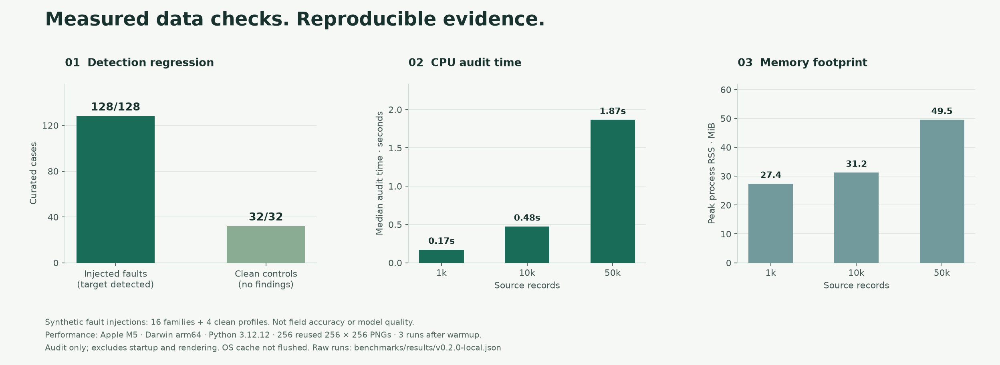

# Benchmark evidence and reproduction

Measured on 2026-10-02 with VLM Data Doctor 0.2.0. These are synthetic software
experiments and a small upstream fixture check, not model-quality or field-adoption results.



## 1. Fault-injection regression corpus

| Measurement | Result |
| --- | ---: |
| Fault families | 16 |
| Variants per fault family | 8 |
| Annotated target findings detected | **128 / 128** |
| Clean controls | 32 across 4 profiles |
| Clean controls with any finding | **0 / 32** |

Families include marker mismatch, missing/corrupt images, invalid roles, empty
answers, unfinished turns, malformed image lists, duplicate samples/IDs, sample/
input/image/group overlap, invalid JSON, duplicate JSON keys and path escape.
Clean profiles include messages, ShareGPT, text-only and group-disjoint samples.

Each faulty case is annotated with one **target rule**. It passes if that rule
appears; additional findings are recorded but not scored as precision because
the corpus does not provide exhaustive labels for every secondary finding.
Clean controls fail on any error or warning. Both types of outcome are preserved
per case in the [raw result](../benchmarks/results/v0.2.0-local.json).

The generator was designed with knowledge of the implementation. This is a
transparent regression corpus, **not an independent, held-out accuracy benchmark**.
Recompressed-image or semantic duplicates are outside the supported detector.
Do not advertise these numbers as 100% detection on arbitrary user datasets.

Reproduce from the repository after installation:

```bash
python -m benchmarks.run --output reports/correctness.json
```

The harness creates temporary fixtures and cleans them up. Its output file is
overwritten if it already exists; unlike the end-user CLI's exclusive `--output`,
this is an explicit experiment-generation command.

## 2. CPU timing and peak memory

Environment: **Apple M5, macOS/Darwin 25.6.0 arm64, Python 3.12.12, Pillow 12.3.0**.
The workload contains unique questions in JSONL, reusing **256 PNG images of
256 × 256 pixels** (50,463,493 image bytes in total). Synthetic image seed: 20261002.

| Records | JSONL bytes | Median audit time | Records / second | Maximum process peak RSS |
| ---: | ---: | ---: | ---: | ---: |
| 1,000 | 199,230 | 0.172 s | 5,799 | 27.4 MiB |
| 10,000 | 2,022,354 | 0.475 s | 21,051 | 31.2 MiB |
| 50,000 | 10,245,130 | 1.867 s | 26,776 | 49.5 MiB |

Method: each measurement runs in a fresh Python process. The first run for each
size is discarded as warmup; the table reports the median of the next three.
`perf_counter()` surrounds `audit()` only, including input hashing and image
validation; interpreter startup and report rendering are excluded. Peak RSS uses
the process high-water mark and includes Python/import memory. The OS cache is
not flushed, and images are cached within each audit by resolved path.

Consequently, increasing the number of rows amortizes the fixed image-pool cost.
These timings do **not** represent 50,000 unique high-resolution images, cold
storage, remote I/O, rendering a huge finding table, model preprocessing or GPU work.
They do not establish superiority over another tool. Results vary with hardware.

Reproduce on macOS or Linux:

```bash
python -m benchmarks.run --output reports/benchmark.json --performance
```

All individual runs, warmups, dataset sizes, environment and definitions are in
the [raw JSON](../benchmarks/results/v0.2.0-local.json). Performance numbers are not
CI pass/fail thresholds. Correctness checks run in CI; timing is collected explicitly.

## 3. LlamaFactory upstream fixture smoke check

The official `mllm_demo.json` at revision
[`ce9dc9e072f80fa3abe0989d4ab90da25f083438`](https://github.com/hiyouga/LlamaFactory/tree/ce9dc9e072f80fa3abe0989d4ab90da25f083438/data)
contains six records referencing three distinct images. The auditor reported
**0 errors and 0 warnings** for that snapshot.

This checks a real upstream example's schema and image decoding. It does **not**
import LlamaFactory, load a tokenizer/model, test a training forward pass, or certify
compatibility with arbitrary versions or other multimodal profiles.

```bash
python -m benchmarks.upstream_smoke --output reports/llamafactory-fixture.json
```

This command explicitly uses the network to download the pinned JSON and three
images into temporary storage. The core `audit()` and CLI remain offline.
Upstream media are not redistributed in this repository; only URLs, hashes,
sizes and the [result](../benchmarks/results/llamafactory-fixture.json) are saved.

## 4. Reproduce the screenshots and figures

```bash
python -m pip install 'matplotlib>=3.9,<4'
python scripts/build_visuals.py
npm install --no-save --package-lock=false playwright
npx playwright install chromium
node scripts/capture_report.cjs
```

The chart reads the committed benchmark JSON. The report screenshot comes from
auditing the committed broken fixture. The browser check exercises severity
filters, search, empty results and a 390-pixel mobile viewport, and checks for
JavaScript errors, external network requests and page-level horizontal overflow.
See [UI verification results](../benchmarks/results/report-ui.json).

These optional figure/browser packages are development tools, not auditor
runtime dependencies. The auditor's only third-party runtime dependency is Pillow.
